# Connecting ServiceNow and Ansible Automation Platform (AAP)

## Sections
[ServiceNow/AAP Integration Instructions using Rest Messages](https://github.com/shadowman-lab/Ansible-SNOW/tree/master/SNOWSetup#servicenowaap-integration-instructions-using-rest-messages)

[ServiceNow/AAP Integration Instructions using Ansible Spoke](https://github.com/shadowman-lab/Ansible-SNOW/tree/master/SNOWSetup#servicenowaap-integration-instructions-using-ansible-spoke)

[Have AAP reach out to ServiceNow](https://github.com/shadowman-lab/Ansible-SNOW/tree/master/SNOWSetup#have-aap-reach-out-to-servicenow)

[Have AAP use ServiceNow as an inventory source](https://github.com/shadowman-lab/Ansible-SNOW/tree/master/SNOWSetup#have-aap-use-servicenow-as-an-inventory-source)

## Connect ServiceNow to Ansible AAP

## Notes
- These instructions assume that there is no MID-Server for ServiceNow, and that the ServiceNow instance and AAP can talk to each other directly over the public internet.
- This has been tested with:
  - Ansible Tower 3.6, 3.7, 3.8, AAP 2.0, 2.1, 2.2
  - ServiceNow Orlando, Paris, Quebec

- While the mid-server is an outbound connection from on-prem to the customer’s ServiceNow Instance, it subscribes to the “ECC Queue” allowing for bidirectional communication between an on-prem AAP and ServiceNow. Because it is polling, there can be a delay between the initiation of an action and the mid-server processing the request.

- If you create outbound REST messages in ServiceNow you can choose to have that executed directly from the ServiceNow instance or via a mid-server. 

- If you have a subscription to ServiceNow’s Standard IntegrationHub pack, there is a spoke for integrating with AAP so you don't have to write you own API requests.

## ServiceNow/AAP Integration Instructions using Rest Messages

### Preparing AAP

#### 1)
In AAP, navigate to **Applications** on the left side of the screen. Click the **Blue Add Button** on the right, which will present you with a Create Application dialog screen. Fill in the following fields:
| Parameter | Value |
|-----|-----|
| Name  | Descriptive name of the application that will contact AAP  |
|  Organization |  `Default` |
|  Authorization Grant Type |  `Authorization code` |
|  Redirect URIs |  `https://<snow_instance_id>.service-now.com/oauth_redirect.do` |
|  Client Type |  `Confidential` |

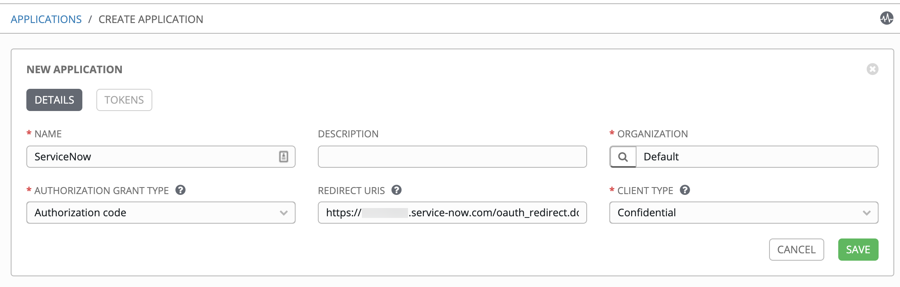

#### 2)
Click the blue **Save** button, at which point a window will pop up, presenting you with the Client ID and Client Secret needed for ServiceNow to make API calls into AAP. This will only be presented **ONCE**, so capture these values for later use.

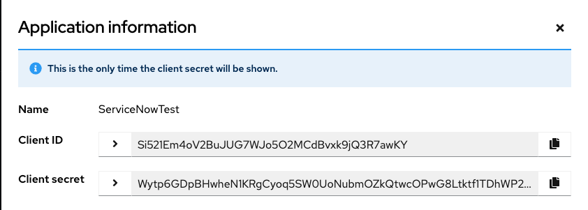

#### 3)
Next, navigate to **Settings** on the left side of the screen and then **Miscellaneous Authentication settings**. After you click Edit at the bottom, you’ll want to toggle the **Allow External Users to Create Oauth2 Tokens** option to ***on***. Click the blue **Save** button to commit the change.

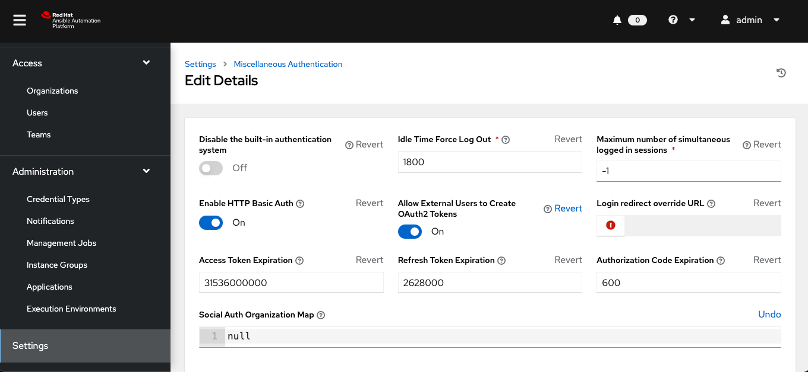

#### 4)
The Orlando release of the ServiceNow developer instance does not allow for the self-signed certificate provided by AAP. We need to equip our AAP instance with a certificate from a trusted Certificate Authority. The easiest way to accomplish this to SSH into AAP and run the Certbot ACME client in order to generate a certificate from LetsEncrypt (instructions can be found [here](https://letsencrypt.org/getting-started/)). It is important to place the contents of the certificate you generate (found at `/etc/letsencrypt/live/<tower domain>/cert.pem`), followed by the LetsEncrypt intermediate certificate (starting on a new line) at location AAP places its self-signed certificate, `/etc/tower/tower.cert`. The LetsEncrypt intermediate certificate can be found [here](https://letsencrypt.org/certs/lets-encrypt-x3-cross-signed.pem.txt). You must also replace the contents of `/etc/tower/tower.key` with the contents of `/etc/letsencrypt/live/<tower domain>/privkey.pem`. 

Be sure to restart the nginx service on your AAP server after updating the certificate and key.

An example of the generated certificate with the intermediate certificate appended (what needs to be place in `/etc/tower/tower.cert`) is pictured below:


### Preparing ServiceNow

#### 5)
Moving over to ServiceNow, Navigate to **System Definition-->Certificates**. This will take you to a screen of all the certificates Service Now uses. Click on the **blue New button**, and fill in these details:
| Parameter | Value |
|-----|-----|
| Name  | Descriptive name of the certificate  |
|  Format |  `PEM` |
|  Type |  `Trust Store Cert` |
|  PEM Certificate |  The certificate to authenticate against AAP with. Use the certificate you just generated on your AAP server, located at `/etc/tower/tower.cert.` Copy the contents of this file (EXCLUDE the intermediate certificate) into the field in ServiceNow. |

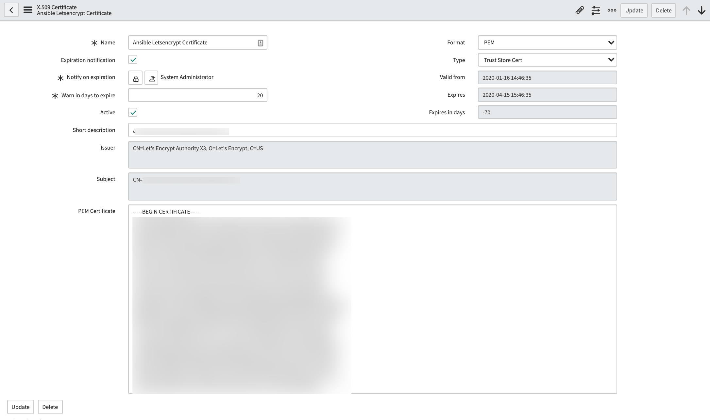

Click the **Submit** button at the bottom.

#### 6)
In ServiceNow, Navigate to **System OAuth-->Application Registry**. This will take you to a screen of all the Applications ServiceNow communicates with. Click on the **blue New button**, and you will be asked What kind of Oauth application you want to set up. Select **Connect to a third party Oauth Provider**.

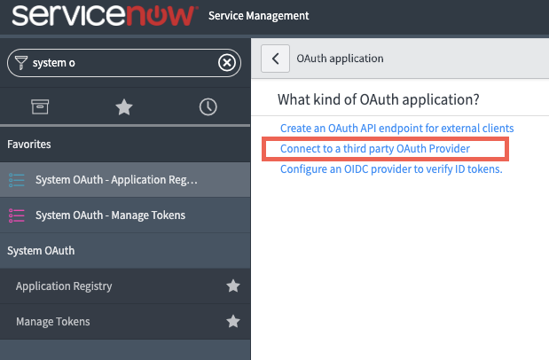

#### 7)
On the new application screen, fill in these details:

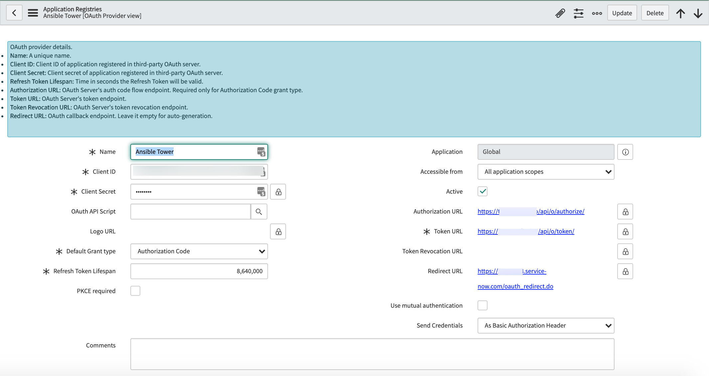

| Parameter | Value |
|-----|-----|
| Name  | Descriptive Application Name  |
|  Client ID |  The Client ID you got from AAP |
|  Client Secret |  The Client Secret you got from AAP |
|  Default Grant Type |  `Authorization Code` |
|  Authorization URL |  `https://<aap_url>/api/o/authorize/` |
|  Token URL |  `https://<aap_url>/api/o/token/` |
|  Redirect URL |  `https://<snow_instance_id>.service-now.com/oauth_redirect.do` |
|  Send Credentials |  `As Basic Authorization Header` |

Click the **Submit** button at the bottom.

#### 8)
You should be taken out to the list of all Application Registries. Click back into the Application you just created. At the bottom, there should be two tabs: Click on the tab **Oauth Entity Scopes**. Under here, there is a section called **Insert a new row…**. Double click here, and fill in the field to say Writing Scope. Click on the **green check mark** to confirm this change. Then, right-click inside the grey area at the top where it says Application Registries and click Save in the menu that pops up.

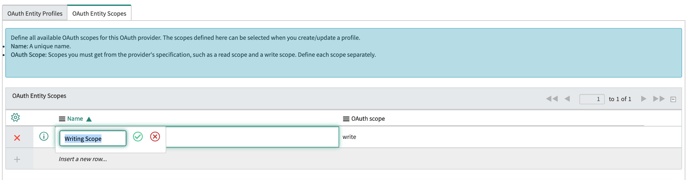

#### 9)
The writing scope should now be Clickable. Click on it, and in the dialog window that you are taken to, type **write** in the Oauth scope box. Click the **Update** button at the bottom.

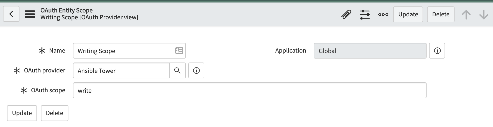

#### 10)
Back in the Application Settings page, scroll back to the bottom and click the **Oauth Entity Profiles** tab. There should be an entity profile populated - click into it.

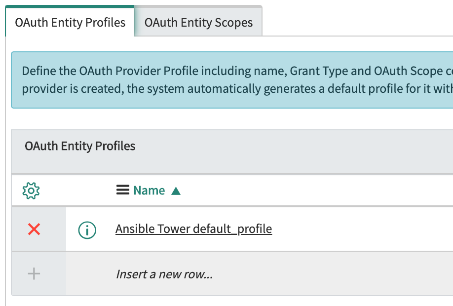

#### 11)
You will be taken to the Oauth Entity Profile Window. At the bottom, Type Writing Scope into the Oauth Entity Scope field. Click the green check mark and **update**.

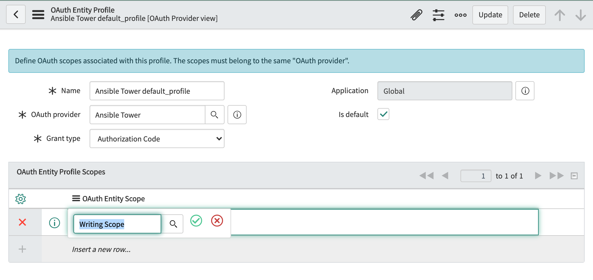

#### 12)
Navigate to **System Web Services-->Outbound-->REST Messages**. Click the blue **New** button. In the resulting dialog window, fill in the following fields:

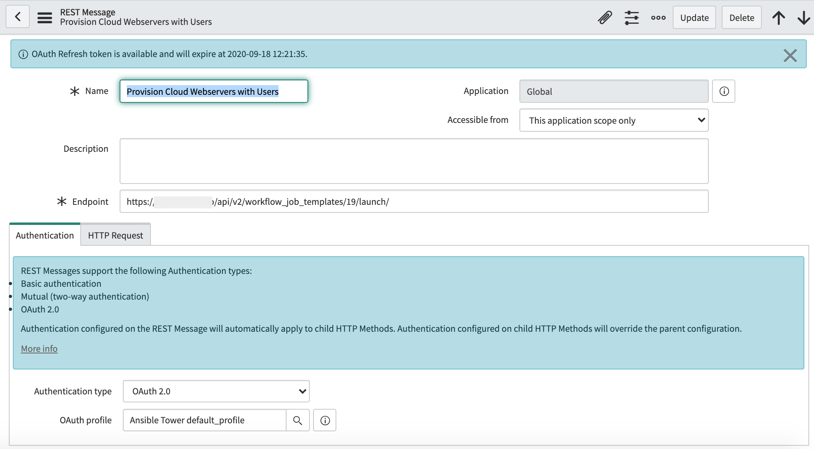

| Parameter | Value |
|-----|-----|
| Name  | `Provision Cloud Webservers with Users`  |
|  Endpoint |  The url endpoint of the AAP action you wish to do. This can be taken from the browsable API at `https://<aap_url>/api` |
|  Authentication Type |  `Oauth 2.0` |
|  Oauth Profile |  Select the Oauth profile you created |

Right-click inside the grey area at the top; click **Save**.

#### 13)
Click the **Get Oauth Token** button on the REST Message screen. This will generate a pop-up window asking to authorize ServiceNow against your AAP instance/cluster. Click Authorize. ServiceNow will now have an Oauth2 token to authenticate against your AAP server.

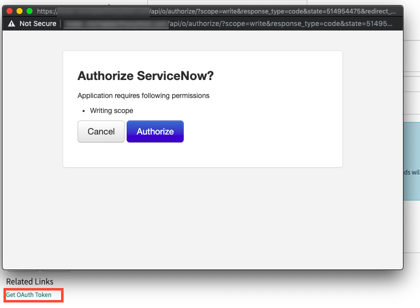

#### 14)
Under the HTTP Methods section at the bottom, click the blue New button. At the new dialog window that appears, fill in the following fields:

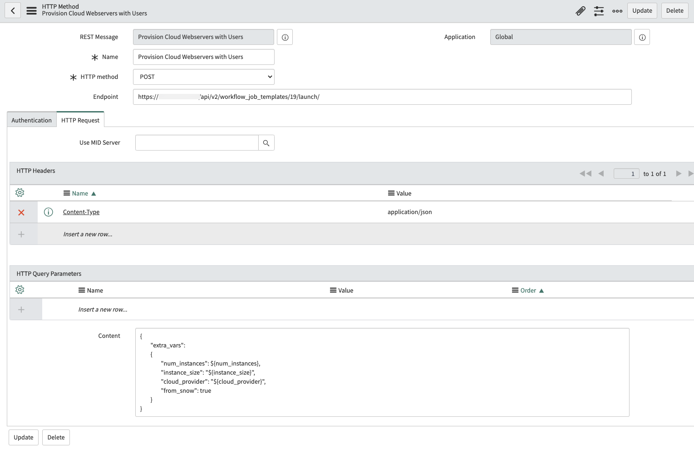

- **HTTP Method**: `POST`
- **Name**: Descriptive HTTP Method Name
- **Endpoint**: The url endpoint of the AAP action you wish to do. This can be taken from the browsable API at `https://<aap_url>/api`
- **HTTP Headers**: ***(under the HTTP Request tab)***
  - The only HTTP Header that should be required is `Content-Type: application/json`
- **HTTP Query Parameters**: ***(under the HTTP Request tab)***
  - If you wish to pass user-provided variables into your Job/Workflow Template, you can add them into the content field. The variable value needs to be in the format `${varname}`. An example for this demonstration:

```
{
	"extra_vars":
	{
		"num_instances": ${num_instances},
		"instance_size": "${instance_size}",
		"cloud_provider": "${cloud_provider}",
		"from_snow": true
	}
}
```
**NOTE** `from_snow` is hard coded to be true; we do not want the user to change this value as this request is in fact coming from ServiceNow.

#### 15)
As we user-provided parameters in the Content field, click on Auto-generate variables in order to generate variables for test runs. Populate the Test value column with some default values that you would like to test your call with (see below for an example). You can then kick off a RESTful call to AAP using these parameters with the **Test** link.

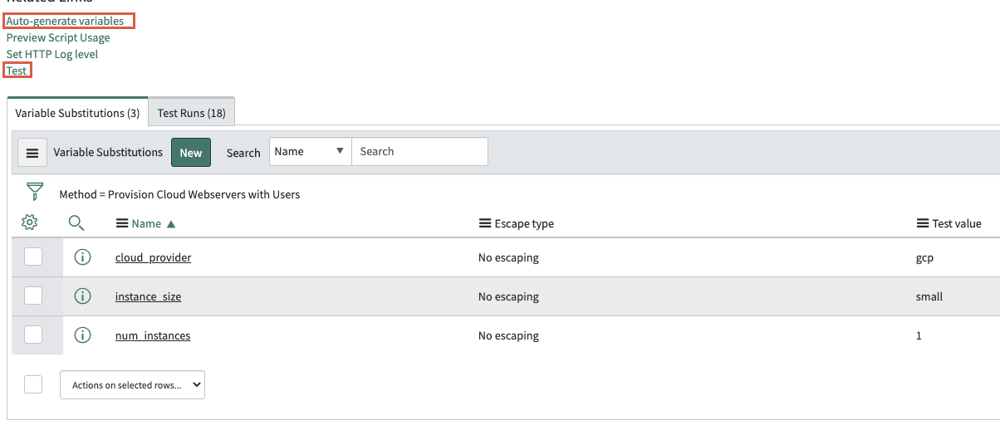

### Testing connectivity between ServiceNow and AAP

#### 16)
Clicking the **Test** link will take you to a results screen, which should indicate that the Restful call was sent successfully to AAP. In this example, ServiceNow kicks off an AAP job Template, and the response includes the Job ID in AAP:  2764


You can confirm that this Job Template was in fact started by going back to AAP and clicking the **Jobs** section on the left side of the screen; a Job with the same ID should be in the list

### Creating a ServiceNow Catalog Item to Launch an AAP Job Template

#### 17)
Now that you are able to make outbound RESTful calls from ServiceNow to AAP, it’s time to create a catalog item for users to select in ServiceNow in a production self-service fashion. While in the HTTP Method options, click the **Preview Script Usage** link:

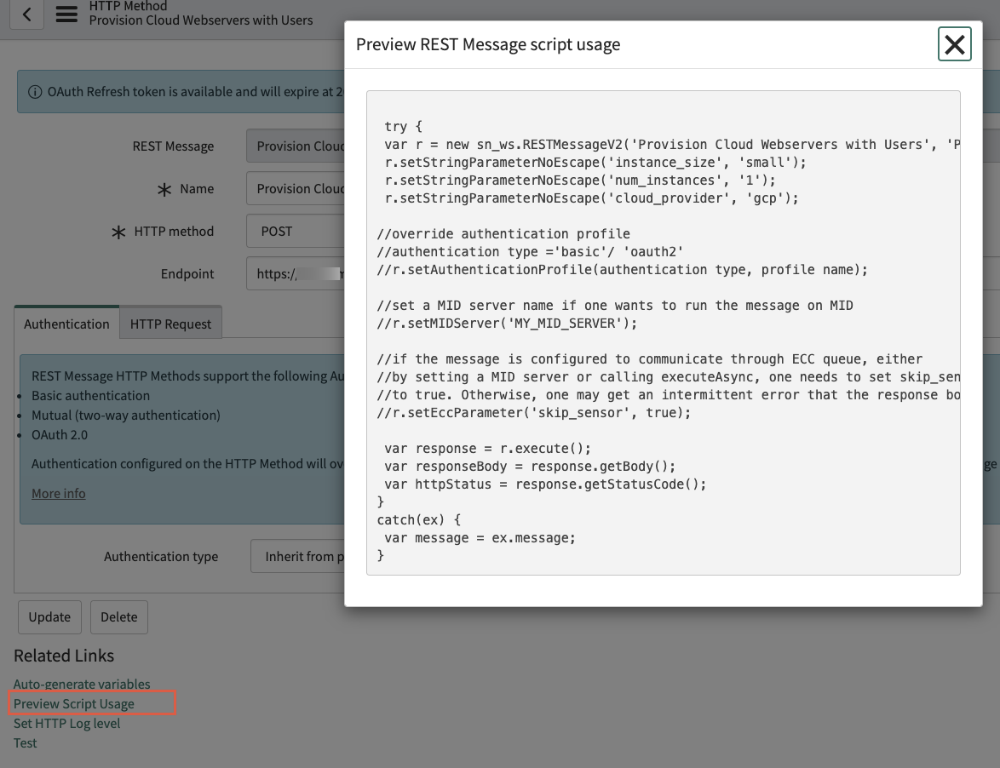

Copy the resulting script the appears, and paste it into a text editor to reference later.

#### 18)
In ServiceNow, navigate to **Workflow-->Workflow Editor**. This will open a new tab with a list of all existing ServiceNow workflows. Click on the blue **New Workflow** button:

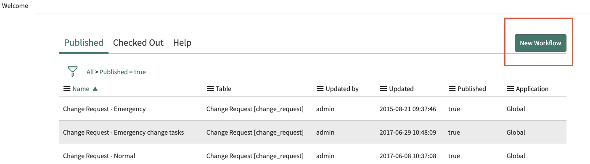

#### 19)
In the New Workflow dialog box that appears, fill in the following options:

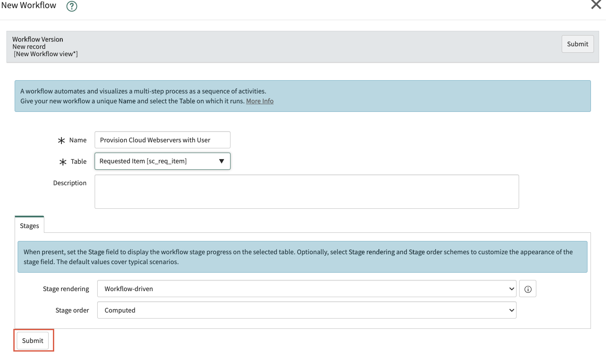

| Parameter | Value |
|-----|-----|
| Name | `Provision Cloud Webservers with Users` |
| Table | `Requested Item [sc_req_item]` |

Everything else can be left alone. Click the **Submit** button.

#### 20)
The resulting Workflow Editor will have only a Begin and End box. Click on the line (it will turn blue to indicate it has been selected), then press **delete** on your keyboard to get rid of it.

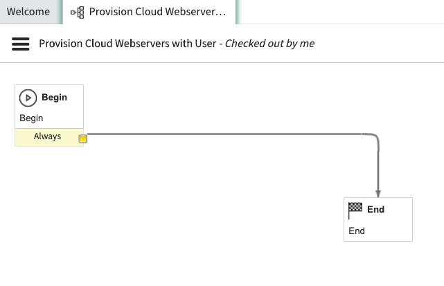

#### 21)
On the right side of the Workflow Editor Screen, select the Core tab and, under **Core Activities-->Utilities**, drag the Run Script option into the Workflow Editor. In the new dialog box that appears, type in a descriptive name (the name of the RESTful call will suffice, `Provision Webservers with Users`), and paste in the script you captured from before. For each variable, replace the default values with ***current.variables.[variablename]*** (see example below). Click **Submit** to save the Script.

If you want to utilize the Service Now request number and pass it to Ansible for closed loop automation, add in **r.setStringParameterNoEscape('ticket_number', current.request.getDisplayValue());** Replace 'ticket_number' with the variable name utilized in the Rest Message.

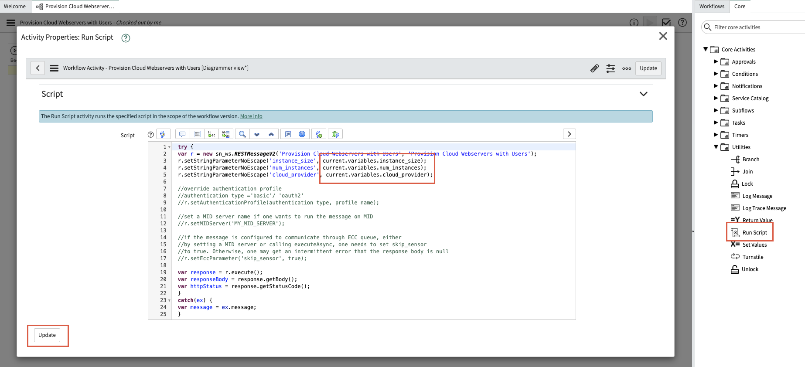

#### 22)
Draw a connection from **Begin**, to the newly created Run Script Box, and another from the **Run Script** box to **End**. Afterward, click on the three horizontal lines to the left of the Workflow name, and select the **Publish** option. You are now ready to associate this workflow with a catalog item.

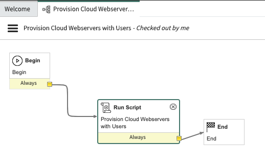

#### 23)
Navigate to **Service Catalog-->Catalog Definitions->Maintain Items**. Click the blue **New** button on the resulting item list. In the resulting dialog box, fill in the following fields:

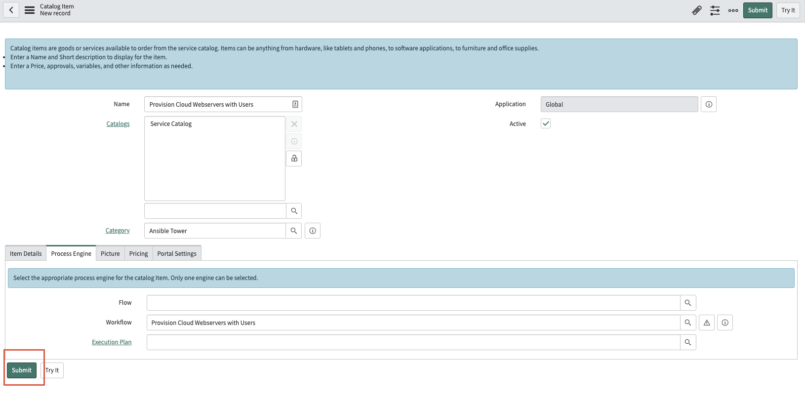

| Parameter | Value |
|-----|-----|
| Name | `Provision Cloud Webservers with Users` |
| Catalog | The catalog that this item should be a part of |
| Category | Required if you wish users to be able to search for this item |


In the Process Engine tab, populate the Workflow field with the Workflow you just created. Click the Submit Button. You’ve now created a new catalog item!

#### 24)
Navigate back to the Catalog Item settings, and at the bottom, click the **New** button under the variables tab. In the window that results, populate the question you want to present to the user, and the variable name. You can also put a default value under the Default Value Tab. If you select a variable type of `Multiple Choice`, after submitting the changes you can add options under the ***Question Choices*** section at the bottom of the Variable settings page.

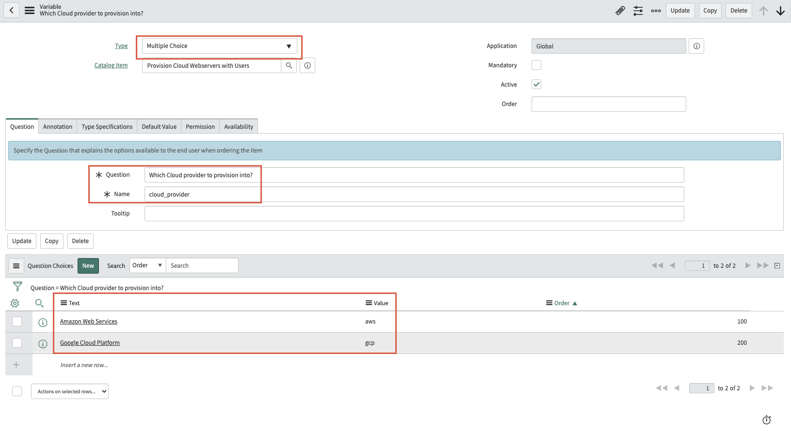

Here are the fields required for each variable in this demo:
##### cloud_provider
| Parameter | Value |
|-----|-----|
| Type | `Multiple Choice` |
| Question | `Which Cloud provider to provision into?` |
| Name | `cloud_provider` |
| Default value | `aws` |

###### variable options
| Text | Value | Order |
|-----|-----|-----|
| `Amazon Web Services` | `aws` | `100` |
| Google Cloud Platform | `gcp` | `200` |

##### num_instances
| Parameter | Value |
|-----|-----|
| Type | `Single Line Text` |
| Question | `How many instances should be spun up? (Any value from 1 through 10)` |
| Name | `num_instances` |
| Default value | `3` |

##### instance_size
| Parameter | Value |
|-----|-----|
| Type | `Multiple Choice` |
| Question | `What size instance should be selected?` |
| Name | `instance_size` |
| Default value | `small` |

###### variable options
| Text | Value | Order |
|-----|-----|-----|
| `small` | `small` | `100` |
| `medium` | `medium` |  `200` |
| `large` | `large` |  `300` |

#### 25)
Lastly, to run this catalog item, navigate to **Self-Service-->Homepage** and search for the catalog item you just created. Once found, click the **order now** button. You can see the results page pop up in ServiceNow, and you can confirm that the Job is being run in AAP.

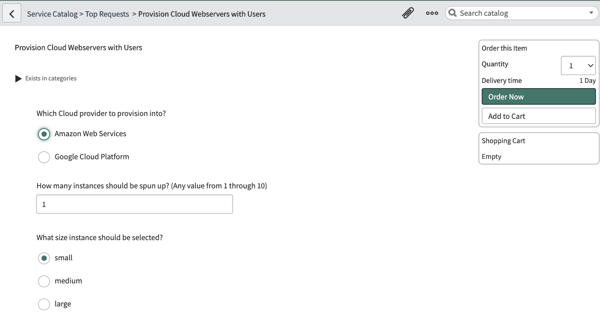

Congratulations! After completing these steps, you can now use a ServiceNow Catalog Item to launch a Workflow Template in AAP. This is ideal for allowing end users to use a front end they are familiar with in order to perform this, and other automated tasks of varying complexities. This goes a long way toward reducing the time to value for the enterprise as a whole, rather than just the teams responsible for writing the playbooks being used.

## ServiceNow/AAP Integration Instructions using Ansible Spoke

This walkthrough assumes you have an Integration Hub Standard/Professional subscription and Ansible spoke activated. It also assumes you have the ability to reach your automation controller from ServiceNow (a mid-server can be utilized). For this example, I will be utilizing an already existing Ansible Automation Platform (AAP) workflow that patches all of my Red Hat Enterprise Linux Servers and updates a ServiceNow Catalog Request. I will also be using Ansible Automation Platform 2.2 but this integration will work in Ansible Automation Platform 1.2 and 2.1 as well. Ansible spoke leverages the ServiceNow Flow Designer which can be easier to use when leveraging variables and building out the API Rest message.

### Preparing AAP

#### 1)
In AAP, navigate to **Applications** on the left side of the screen. Click the **Blue Add Button** on the right, which will present you with a Create Application dialog screen. Fill in the following fields:
| Parameter | Value |
|-----|-----|
| Name  | Descriptive name of the application that will contact AAP  |
|  Organization |  `Default` |
|  Authorization Grant Type |  `Authorization code` |
|  Redirect URIs |  `https://<snow_instance_id>.service-now.com/api/sn_ansible_spoke/ansible_oauth_redirect` |
|  Client Type |  `Confidential` |


#### 2)
Click the blue **Save** button, at which point a window will pop up, presenting you with the Client ID and Client Secret needed for ServiceNow to make API calls into AAP. This will only be presented **ONCE**, so capture these values for later use.


#### 3)
Next, navigate to **Settings** on the left side of the screen and then **Miscellaneous Authentication settings**. After you click Edit at the bottom, you’ll want to toggle the **Allow External Users to Create Oauth2 Tokens** option to ***on***. Click the blue **Save** button to commit the change.


#### 4)
The Orlando release of the ServiceNow developer instance does not allow for the self-signed certificate provided by AAP. We need to equip our AAP instance with a certificate from a trusted Certificate Authority. The easiest way to accomplish this to SSH into AAP and run the Certbot ACME client in order to generate a certificate from LetsEncrypt (instructions can be found [here](https://letsencrypt.org/getting-started/)). It is important to place the contents of the certificate you generate (found at `/etc/letsencrypt/live/<tower domain>/cert.pem`), followed by the LetsEncrypt intermediate certificate (starting on a new line) at location AAP places its self-signed certificate, `/etc/tower/tower.cert`. The LetsEncrypt intermediate certificate can be found [here](https://letsencrypt.org/certs/lets-encrypt-x3-cross-signed.pem.txt). You must also replace the contents of `/etc/tower/tower.key` with the contents of `/etc/letsencrypt/live/<tower domain>/privkey.pem`. 

Be sure to restart the nginx service on your AAP server after updating the certificate and key.

An example of the generated certificate with the intermediate certificate appended (what needs to be place in `/etc/tower/tower.cert`) is pictured below:


### Preparing ServiceNow

#### 5)
Moving over to ServiceNow, Navigate to **System Definition-->Certificates**. This will take you to a screen of all the certificates Service Now uses. Click on the **blue New button**, and fill in these details:
| Parameter | Value |
|-----|-----|
| Name  | Descriptive name of the certificate  |
|  Format |  `PEM` |
|  Type |  `Trust Store Cert` |
|  PEM Certificate |  The certificate to authenticate against AAP with. Use the certificate you just generated on your AAP server, located at `/etc/tower/tower.cert.` Copy the contents of this file (EXCLUDE the intermediate certificate) into the field in ServiceNow. |


Click the **Submit** (or **Update** if you had a previous AAP certificate) button at the bottom.

### Set Up Ansible Spoke

#### 6)
Navigate to **Connections & Credentials-->Connection & Credential Aliases**. Click the existing "AnsibleTowerAlias" alias. In the resulting dialog window, ensure the following fields are filled in:

| Parameter | Value |
|-----|-----|
| Name  | `AnsibleTowerAlias`  |
|  Application |  Ansible Spoke |
|  Type |  Connection and Credential |
|  Connection Type |  HTTP |
|  Default Retry Policy |  Default HTTP Retry Policy |
|  Configuration Template |  Ansible |

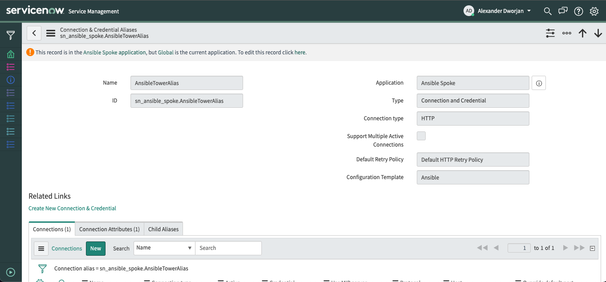

#### 7)
Under Related Links select "Create New Connection & Credential" and enter in the following information:

| Parameter | Value |
|-----|-----|
| Connection Name  | `<provider-name> Spoke Connection` |
|  Connection URL  |  `https://<aap_url>/api/o/authorize/` |
|  Credential Name |  `<provider-name> Spoke Credentials` |
|  Application Registry Name |  `<provider-name>` |
|  OAuth Client ID | The Client ID you got from AAP |
|  OAuth Client Secret | The Client Secret you got from AAP |
|  OAuth Entity Profile Name | Ansible Entity Profile |
|  OAuth Entity Scope | `write` |
|  Authorization URL |  `https://<aap_url>/api/o/authorize/` |
|  Token URL |  `https://<aap_url>/api/o/token/` |
|  OAuth Redirect URL |  `https://<snow_instance_id>.service-now.com/api/sn_ansible_spoke/ansible_oauth_redirect` |

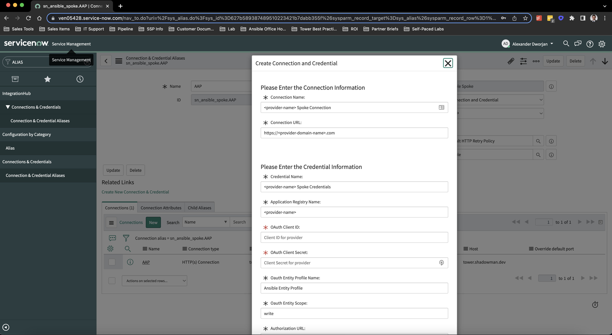

Select **Create and Get OAuth Token** to complete the Ansible spoke set up.  This will generate a window asking to authorize ServiceNow against your AAP instance/cluster. Click **Authorize**. 

Note: If you wish to have AAP use a specific user when reaching out from ServiceNow (such as a dedicated servicenow user) ensure you are logged in as that user when you click **Authorize**.

### Create a Catalog Item for Users

#### 8)
Navigate to **Service Catalog-->Catalog Definitions->Maintain Items**. Click the blue **New** button on the resulting item list. In the resulting dialog box, fill in the following fields:

| Parameter | Value |
|-----|-----|
| Name | `AAP Ansible Spoke Patch` |
| Catalog | The catalog that this item should be a part of |
| Category | Required if you wish users to be able to search for this item |

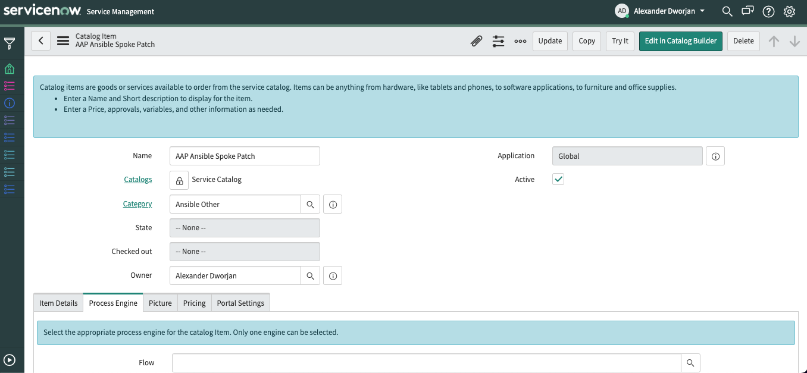

#### 9)
Navigate back to the Catalog Item settings, and at the bottom, click the **New** button under the variables tab. In the window that results, populate the question you want to present to the user, and the variable name. You can also put a default value under the Default Value Tab. If you select a variable type of `Multiple Choice`, after submitting the changes you can add options under the ***Question Choices*** section at the bottom of the Variable settings page.

Here are the fields required for each variable in this demo:

##### exclude
| Parameter | Value |
|-----|-----|
| Type | `Single Line Text` |
| Question | `What packages would you like to exclude?` |
| Name | `exclude` |

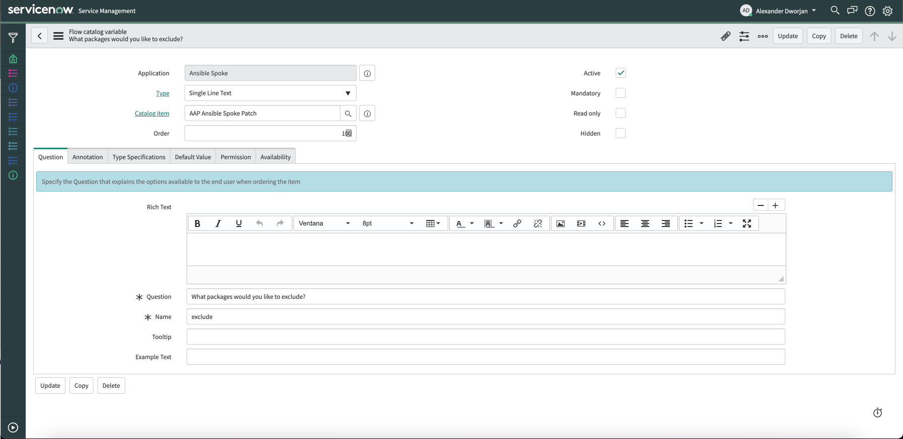

### Update Spoke Actions For Workflow Job Templates

#### 10)
Navigate to **Process Automation-->Flow Designer**

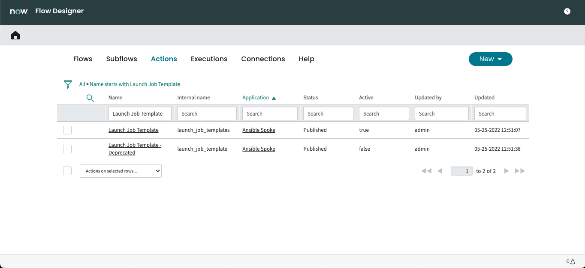

This will open up a new tab. Click Actions and in the Name section type "Launch Job Template" and hit enter. Select the Launch Job Template Action.

#### 11)
Once it loads, click the 3 dots in the top right and select "Copy Action"

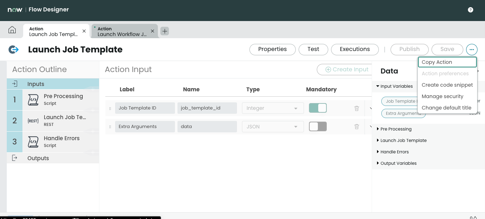

Enter in a name and select Ansible Spoke as the Application in the box that opens.

| Parameter | Value |
|-----|-----|
| New action name | `Launch Workflow Job Template` |
| Application | `Ansible Spoke` |

In this new action, Create a new label "Workflow Job Template ID" set to Mandatory and delete "Job Template ID"

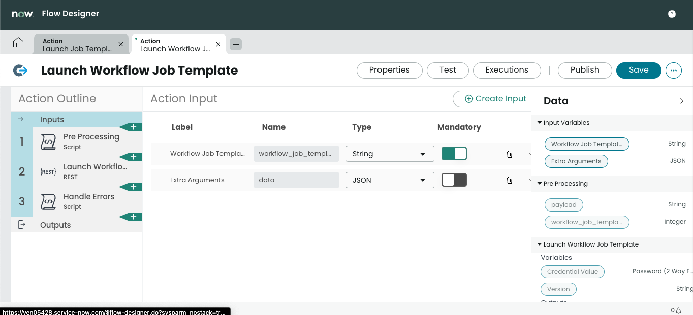

Select Pre Processing on the left-hand side

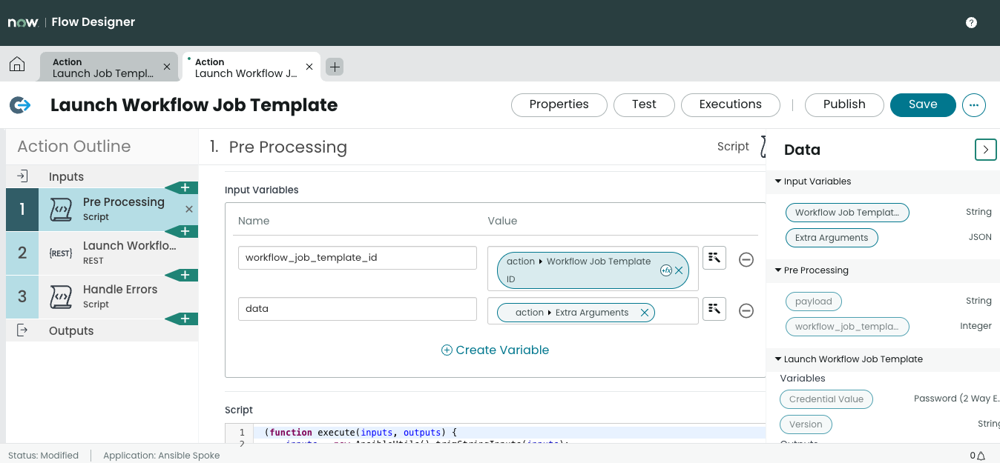

In the Input Variables section change "job_template_id" to "workflow_job_template_id" and for value drag in Workflow Job Template ID from the right side under input variables

Update the script to utilize this new id:
```
(function execute(inputs, outputs) {
    inputs = new AnsibleUtils().trimStringInputs(inputs);
    outputs.workflow_job_template_id = inputs.workflow_job_template_id;
    if (inputs.data) {
        outputs.payload = new AnsibleUtils().validateJson(inputs.data);
    }
})(inputs, outputs);
```

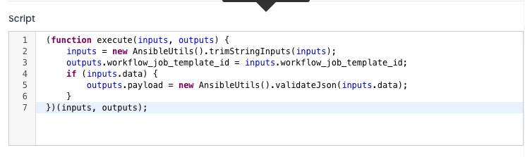

In the Output Variables section create a new label "workflow_job_template_id" set to Mandatory and delete "job_template_id"

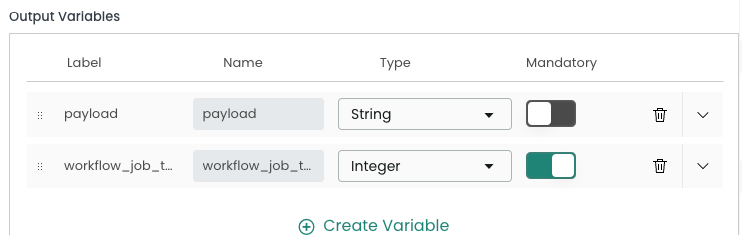

Select Launch Workflow on the left-hand side

Scroll down to the Resource Path section and change the url portion from "job_templates" to "workflow_job_templates" and ensure you drag over from Pre Processing the workflow_job_template_id so the Resource path looks like "api/step->Launch Job Template->Version/workflow_job_templates/step->Pre Processing->workflow_job_template_id"

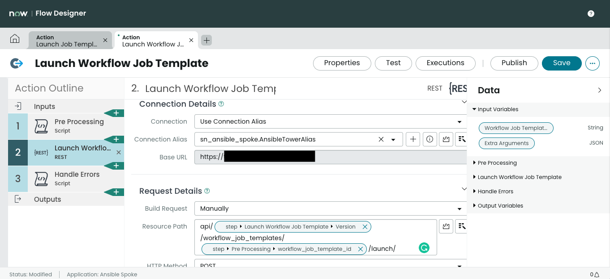

Click Save and then Publish

### Create Flow For A Catalog Item Request

#### 12)
Go back to the Flow Designer home, click home in the top left. Click on the blue **New**, and then Flow.

| Parameter | Value |
|-----|-----|
| Flow Name  | AAP Patching |
|  Application |  Global |

Click on the blue **Submit** Button

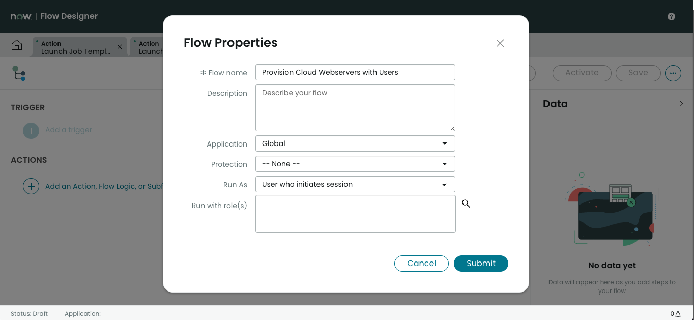

#### 13)
In the New Tab that appears, click Add a trigger, select Service Catalog, Select Advanced Options and select "Run flow in background (default)" 

Click on the blue **Done** Button

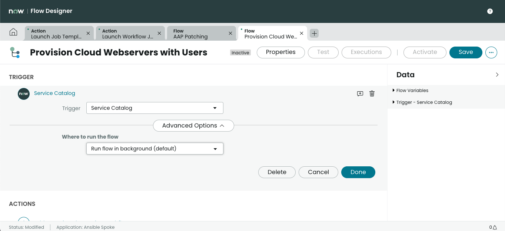

#### 14)
Under Actions, Select "Add an Action, Flow Logic or Subflow" then select Action. Select "Get Catalog Variables". Drag "Requested Item Record" from the right side into the "Submitted Request [Requested Item] box"

In "Template Catalog Items and Variable Sets [Catalog Items and Variable Sets]" Select your Catalog Item from before "AAP Ansible Spoke Patch" Select the variables you want to pass to AAP "exclude" and click the right arrow.


Click on the blue **Done** Button

#### 15)
Under Actions, Select "Add an Action, Flow Logic or Subflow" then select Action. Under the Ansible Spoke select "Launch Job Template" or "Launch Workflow Job Template" depending on which type you want to run.

Enter in the template ID number from AAP and any extra arguments the job requires (this includes limits, survey items, etc). For the arguments, you can drag the variables from step one or from the trigger into the appropriate position.
```
{
	"extra_vars":
	{
		"exclude": "DRAGGED FROM STEP1",
		"ticket_number": "DRAGGED FROM STEP1"
	}
}
```
Click on the blue **Done** Button

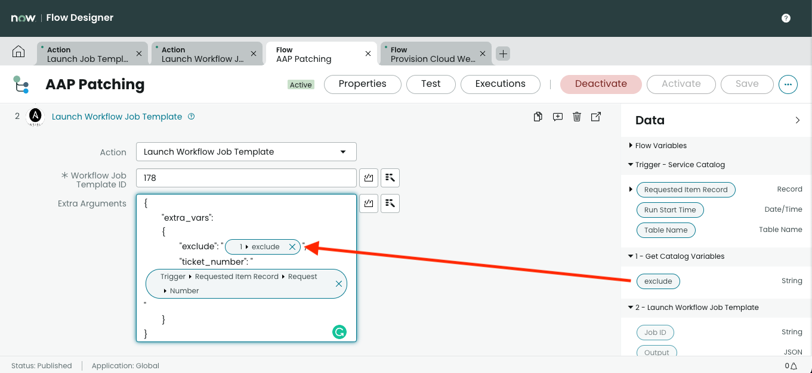

Click Save and then click Activate on the top bar

### Update Catalog With Newly Created Flow

#### 16)
Navigate back to **Service Catalog-->Catalog Definitions->Maintain Items** and select the item you created earlier. Click on **Process Engine** and then populate the Flow field with the Flow you just created.

Right-click inside the grey area at the top; click **Save**.

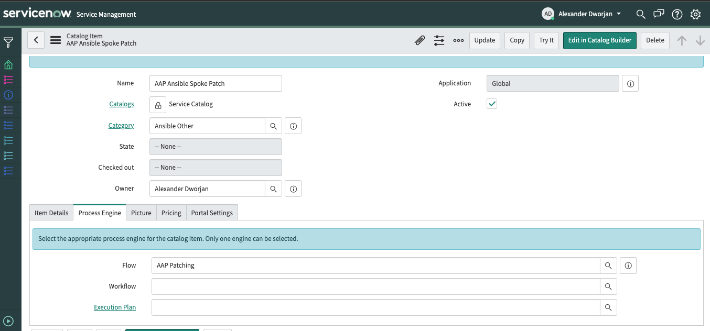

#### 17)
Lastly, to run this catalog item, navigate to **Self-Service-->Service Catalog** and search for the catalog item you just created. Once found, click the **Order Now** button. You can see the results page pop up in ServiceNow, and you can confirm that the Job is being run in AAP.

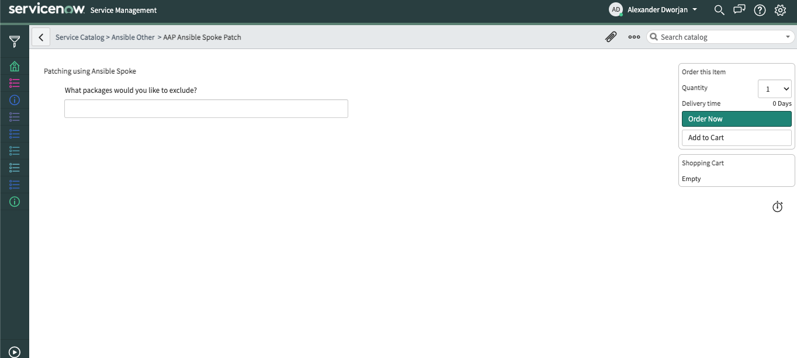

Congratulations! After completing these steps, you can now use a ServiceNow Catalog Item to launch a Template in AAP using Ansible Spoke. This is ideal for allowing end users to use a front end they are familiar with in order to perform this, and other automated tasks of varying complexities. This goes a long way toward reducing the time to value for the enterprise as a whole, rather than just the teams responsible for writing the playbooks being used.

## Have AAP reach out to ServiceNow

## Dependencies:

### Ansible Engine
- ansible version >= 2.9

### Collections

```bash
servicenow.itsm
```

Or if using AAP and want to attach it to a project, create a file at **collections/requirements.yml** and add

```bash
collections:

  - name: servicenow.itsm
```

This collection will be required when running >Ansible 2.10

### Create a custom credential

Creating a custom credential in AAP will allow you to pass in your ServiceNow instance, username, and password as environment variables. This means you won't need to include them in your playbook.

#### 1)
In AAP, navigate to **Credential Types** on the left side of the screen. Click the **Blue Add Button** on the top, which will present you with a New Credential Type dialog screen. Fill in the following fields:
| Parameter | Value |
|-----|-----|
| Name  |  `ServiceNow ITSM Credential`  |
| Description | Description of your credential type |

Input Configuration

```
fields:
  - id: instance
    type: string
    label: Instance
  - id: username
    type: string
    label: Username
  - id: password
    type: string
    label: Password
    secret: true
required:
  - instance
  - username
  - password
```

Injector Configuration


```
env:
  SN_HOST: '{{instance}}'
  SN_PASSWORD: '{{password}}'
  SN_USERNAME: '{{username}}'
```

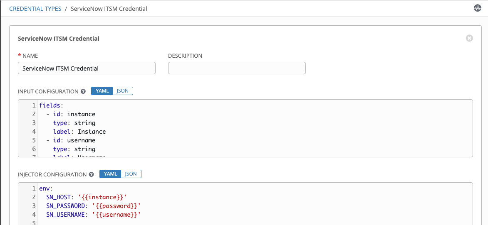

#### 2) Create your ServiceNow Credential

| Parameter | Value |
|-----|-----|
| Name | `ServiceNow ITSM Credential` |
| Description | Description of your credential |
| Organization |  `Default` |
| Credential Type | `ServiceNow ITSM Credential` |
| Instance | `<snow_instance_id> including .service-now.com` |
| Username | `SNOW Username` |
| Password | `SNOW Password` |

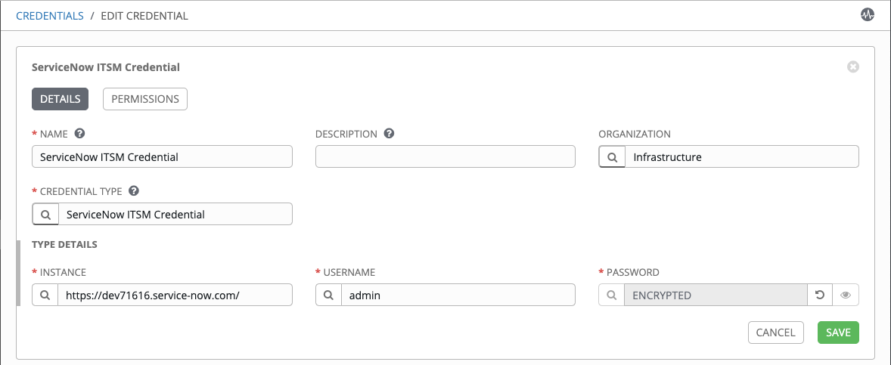

#### 3) Create a Job Template

Create a playbook in your repo utilzing your new Ansible collection referencing the apppropriate modules. When creating your job template, ensure you select the ServiceNow credential that you created.

Congratulations! You can now have AAP reach out to SNOW to query and update records!

# Example playbooks

## Creating an incident in SNOW with custom fields that uses stored facts in Ansible to populate IP address, OS, and VM name
```
- name: Create an incident in ServiceNow
  hosts: "{{ vm_name }}"
  gather_facts: yes
  connection: local
  
  tasks: 
  
  - name: Create an incident in ServiceNow
    servicenow.itsm.incident:
      state: new
      description: "{{ sn_description | default(omit) }}"
      short_description: "{{ incident_description }}"
      caller: admin
      urgency: "{{ sn_urgency }}"
      impact: "{{ sn_impact }}"
      other:
        u_operating_system: "{{ os | default(omit) }}"
        u_ip_address: "{{ ip_addr | default(omit) }}"
        u_vm_name: "{{ inventory_hostname | default(omit) }}"       
    register: new_incident
    delegate_to: localhost

  - debug: 
      var: new_incident.record.number
```

## Update a ServiceNow catalog request using the ID passed from SNOW
```
- name: Update a catalog item in ServiceNow
  hosts: localhost
  gather_facts: no
  
  tasks: 
  
  - name: Retrieve catalog request sysid
    servicenow.itsm.api_info:
      resource: sc_request
      sysparm_query: numberSTARTSWITH{{ ticket_number }}
    register: requestresult
    when: ticket_number != ''

  - name: Update a catalog work notes and state in ServiceNow
    servicenow.itsm.api:
      action: patch
      resource: sc_request
      sys_id: "{{ requestresult.record[0].sys_id }}"
      data:
        request_state: "{{ request_state | default(omit) }}"
        work_notes: "{{ work_notes }}"
    when: ticket_number != '' 
```

## Have AAP use ServiceNow as an inventory source

## Dependencies:

### Ansible Engine
- ansible version >= 2.9

### Collections

```bash
servicenow.itsm
```

### Create a custom credential if not already done

Creating a custom credential in AAP will allow you to pass in your ServiceNow instance, username, and password as environment variables. This means you won't need to include them in your playbook.

#### 1)
In AAP, navigate to **Credential Types** on the left side of the screen. Click the **Blue Add Button** on the right, which will present you with a New Credential Type dialog screen. Fill in the following fields:
| Parameter | Value |
|-----|-----|
| Name  |  `ServiceNow ITSM Credential`  |
| Description | Description of your credential type |

Input Configuration

```
fields:
  - id: instance
    type: string
    label: Instance
  - id: username
    type: string
    label: Username
  - id: password
    type: string
    label: Password
    secret: true
required:
  - instance
  - username
  - password
```

Injector Configuration


```
env:
  SN_HOST: '{{instance}}'
  SN_PASSWORD: '{{password}}'
  SN_USERNAME: '{{username}}'
```


#### 2) Create your ServiceNow Credential

In AAP, navigate to **Credentials** on the left side of the screen. Click the **Blue Add Button** on the right, which will present you with a New Credential dialog screen. Fill in the following fields:


| Parameter | Value |
|-----|-----|
| Name | `ServiceNow ITSM Credential` |
| Description | Description of your credential |
| Organization |  `Default` |
| Credential Type | `ServiceNow ITSM Credential` |
| Instance | `<snow_instance_id> from URL including .service-now.com` |
| Username | `SNOW Username` |
| Password | `SNOW Password` |


#### 3) Inventory yml file

Create a playbook in your repo utilzing your new Ansible collection. Note, the instance field does require the full domain name at this time. Name the file now.yml or now.yaml. You can adjust the selection order, fields, compose, and keyed_groups per the documenation https://github.com/ServiceNowITOM/servicenow-ansible/blob/devel/docs/inventory.md
```
# now.yml
plugin: servicenow.itsm.now
inventory_hostname_source: host_name
columns:
  - host_name
  - name
  - fqdn
  - ip_address
  - os
  - classification
  - sys_id
compose:
  ip_addr: ip_address
  ansible_host: host_name
keyed_groups:
  - key: os
    separator: ""
  - key: classification
    separator: ""
```

#### 4) Create your ServiceNow Inventory

In AAP, navigate to **Inventories** on the left side of the screen. Click the **Blue Add Button** on the right, which will present you with a New Inventory dialog screen. Fill in the following fields:


| Parameter | Value |
|-----|-----|
| Name | `ServiceNow Inventory` |
| Description | Description of your Inventory |
| Organization |  `Default` |

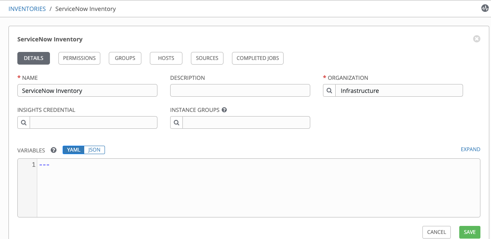

#### 5) Create your ServiceNow Source

In AAP, after you've saved, click to **Sources** on the top of the screen. Click the **Blue Add Button** on the right, which will present you with a New Inventory dialog screen. Fill in the following fields:


| Parameter | Value |
|-----|-----|
| Name | `ServiceNow Inventory` |
| Description | Description of your Inventory |
| Source |  `Sourced from a Project` |
| Credential |  `ServiceNow ITSM Credential` |
| Project |  `Project that contains your now.yml playbook` |
| Inventory File |  `Type the exact location of the file in the repo i.e. inventories/now.yml` |

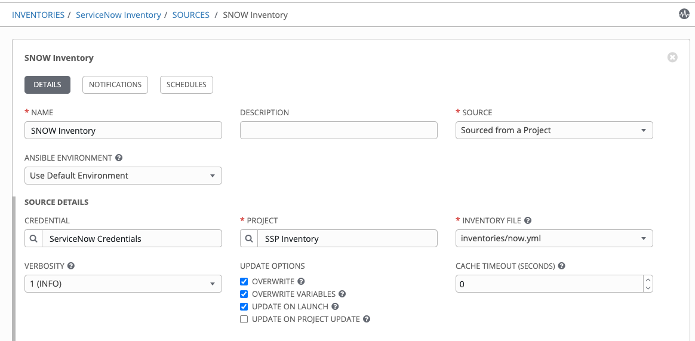

Save and then sync the inventory. You now have a dynamic inventory from ServiceNow

<!-- # Table Of Contents
- [Software Requirements](#requirements)
- [Variables](#variables)
  * [default-vars.yml](#default-variables)
  * [linux_users.yml](#linux-users)
- [Credentials](#credentials)
  * [gmail_creds.yml](#gmail-credentials)
  * [redhat-activation-key.yml](#redhat-activation-key)
  * [snow_creds.yml](#servicenow-credentials)
  * [tower_creds.yml](#tower-credentials)
  * [vault_creds.yml](#hashicorp-vault-credentials)

## Requirements -->
